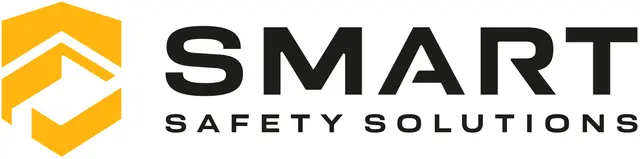

# Smart Safety Solutions Monorepo

<a alt="Nx logo" href="https://smart-safety-solutions.com" target="_blank" rel="noreferrer"></a>

Monorepo for Smart Safety Solution web applications.

## Primary frameworks and libraries

- [TypeScript](https://www.typescriptlang.org/) - Typed JavaScript language
- [React](https://react.dev/) - UI framework
- [RTK Query](https://redux-toolkit.js.org/rtk-query/overview) - Data fetching and caching
- [Redux Toolkit](https://redux-toolkit.js.org/) - State management
- [Shadcn](https://ui.shadcn.com/) - Component library generation
- [Tailwind](https://tailwindcss.com/) - Inline styling
- [Next.js](https://nextjs.org/) - React web framework
- [Nx](https://nx.dev/) - Monorepo support and code generation

### RTK Query

The repo uses RTK Query for data fetching, manipulation, and caching. Existing APIs and new APIs can be updated in the [apis package](./packages/apis/). Each service requires it's own RTK Query API. Documentation for RTK Query can be found [here](https://redux-toolkit.js.org/rtk-query/overview).

### Redux Toolkit

State management not related to API data is handled using [Redux Toolkit](https://redux-toolkit.js.org/). To separate RTK Query data caching from other state management, Redux Toolkit code lives in it's own [contexts package](./packages/contexts/) and is accessed from apps using React Context instead of Redux.

### Shadcn

The repo uses [Shadcn](https://ui.shadcn.com/) to create an internal component libary. Components live in the
[components package](./packages/components/), and new components can be updated through the Shadcn CLI. The [Shadcn documentation](https://ui.shadcn.com/docs) provides information about it's use, however, generally new componenents will be added by navigating to the [components package](./packages/components/) and running a component generation script, such as `npx shadcn@latest add button`. The generated component can then be imported into apps from the components package.

Coming soon: script to add new Shadcn components from the repo root.

### Tailwind

Styling is handled using [Tailwind](https://tailwindcss.com/). This allows for easily styling components directly in component files.

New apps will need their own Tailwind setup. Documentation for this can be found [here](https://ui.shadcn.com/docs/installation). This allows each app to set it's own theme colors and styles as necessary.

### Nx

This repo utilizes Nx for monorepo support. Run `npx nx graph` to generate a visualization of the app and package dependencies.

#### Run tasks

To run the dev server for the admin app, use:

```sh
npx nx dev smart-safety-solutions-admin
```

To create a production bundle for the admin app use:

```sh
npx nx build smart-safety-solutions-admin
```

To see all available targets, run:

```sh
npx nx show project smart-safety-solutions-admin
```

These targets are either [inferred automatically](https://nx.dev/concepts/inferred-tasks?utm_source=nx_project&utm_medium=readme&utm_campaign=nx_projects) or defined in the `project.json` or `package.json` files.

[More about running tasks in the docs](https://nx.dev/features/run-tasks?utm_source=nx_project&utm_medium=readme&utm_campaign=nx_projects)

#### Adding new apps and packages

Leveraging [Nx plugins](https://nx.dev/concepts/nx-plugins?utm_source=nx_project&utm_medium=readme&utm_campaign=nx_projects) and [code generators](https://nx.dev/features/generate-code?utm_source=nx_project&utm_medium=readme&utm_campaign=nx_projects) are recommended for adding new apps and packages.

You can use `npx nx list` to get a list of installed plugins. Then, run `npx nx list <plugin-name>` to learn about more specific capabilities of a particular plugin. Alternatively, [install Nx Console](https://nx.dev/getting-started/editor-setup?utm_source=nx_project&utm_medium=readme&utm_campaign=nx_projects) to browse plugins and generators in your IDE.

[Learn more about Nx plugins](https://nx.dev/concepts/nx-plugins?utm_source=nx_project&utm_medium=readme&utm_campaign=nx_projects) | [Browse the plugin registry](https://nx.dev/plugin-registry?utm_source=nx_project&utm_medium=readme&utm_campaign=nx_projects)

[Learn more about Nx on CI](https://nx.dev/ci/intro/ci-with-nx#ready-get-started-with-your-provider?utm_source=nx_project&utm_medium=readme&utm_campaign=nx_projects)

#### Install Nx Console

Nx Console is an editor extension that enriches your developer experience. It lets you run tasks, generate code, and improves code autocompletion in your IDE. It is available for VSCode and IntelliJ.

[Install Nx Console](https://nx.dev/getting-started/editor-setup?utm_source=nx_project&utm_medium=readme&utm_campaign=nx_projects)

#### Useful Nx links

Learn more:

- [Learn more about this workspace setup](https://nx.dev/nx-api/next?utm_source=nx_project&utm_medium=readme&utm_campaign=nx_projects)
- [Learn about Nx on CI](https://nx.dev/ci/intro/ci-with-nx?utm_source=nx_project&utm_medium=readme&utm_campaign=nx_projects)
- [Releasing Packages with Nx release](https://nx.dev/features/manage-releases?utm_source=nx_project&utm_medium=readme&utm_campaign=nx_projects)
- [What are Nx plugins?](https://nx.dev/concepts/nx-plugins?utm_source=nx_project&utm_medium=readme&utm_campaign=nx_projects)
